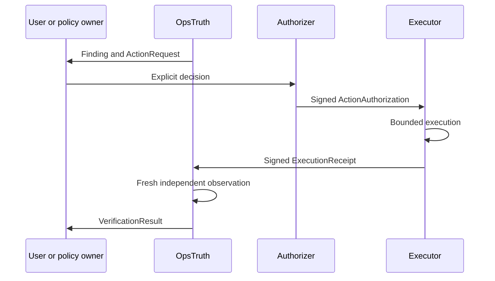

# Execution Plane Protocol

Status: protocol-first design for a later product
Protocol family: `opstruth.action-*` 1.0.0

## Decision

Target mutation does not belong in OpsTruth. It belongs in a separately authorised execution plane, provisionally called Executioner.

Executioner is made real as a protocol before it is made real as a product. OpenClaw, Codex, CI runners, or a future native service may implement the protocol without becoming part of the OpsTruth evidence plane.

## Closed-loop sequence

No arrow in this sequence gives OpsTruth permission to mutate the inspected system.

## Protocol artifacts

| Artifact | Producer | Meaning |
| --- | --- | --- |
| ActionRequest | OpsTruth or another planner | Proposed outcome and bounded operation envelope. It grants no authority. |
| ActionAuthorization | Human or policy authority | Explicit, expiring permission bound to one request digest. |
| ExecutionReceipt | Executor | Signed claims about attempted operations and produced resources. |
| VerificationResult | OpsTruth | Independent comparison of expected and freshly observed state. |

Machine-readable schemas live under `contracts/`. Normative behavior is documented under `docs/contracts/`.

## Separation requirements

The verifier, authorizer, and executor must use distinct identities and signing keys. Production policy should prevent one service identity from impersonating another.

At minimum:

- OpsTruth cannot issue ActionAuthorization.
- The executor cannot mark its own outcome `VERIFIED`.
- A valid ExecutionReceipt cannot substitute for fresh observation.
- Authorization is bound to the ActionRequest digest, subject, scope, expiry, and nonce.
- The executor rejects authority broader than the request.
- Verification records the exact receipt and authorization digests it evaluated.

## ActionRequest behavior

An ActionRequest describes a desired outcome, explicit assertions, permitted operation classes, forbidden operations, target scope, expiry, and idempotency key.

It must be narrow enough that an authorizer can understand the proposed authority. Text such as "fix everything" or "do what is necessary" is invalid for production execution.

OpsTruth may prepare this artifact because planning a mutation is not performing or authorising it.

## Authorization behavior

Authorization must be explicit and independently signed. It cannot be inferred from:

- receipt existence;
- a user asking OpsTruth to audit a repository;
- installation of a read-only provider integration;
- possession of an executor credential;
- an earlier authorization for a similar request;
- a maintainer-bot approval in the OpsTruth repository.

Expired, replayed, revoked, digest-mismatched, or over-broad authorization must fail closed before mutation.

## Executor behavior

An executor implementation must:

1. Validate schema versions and signatures.
2. Bind request, authorization, repository, commit, environment, and idempotency key.
3. Resolve exact resources before mutation.
4. Apply the narrowest granted operation set.
5. Enforce time, resource, path, network, and credential limits.
6. Record ordered operations and affected-resource identities.
7. Stop on scope expansion or contradictory preconditions.
8. Emit a signed receipt for success, failure, partial completion, cancellation, or rejection.
9. Preserve recoverability information without embedding secret values.
10. Never claim independent verification.

## Replay and idempotency

The idempotency key is bound to the request digest and subject. An executor must return the prior terminal receipt for an exact replay or reject an incompatible reuse.

Authorization nonce consumption must be atomic in any production implementation. A receipt should record whether the authorization was consumed and the terminal state reached.

Retries after an unknown or partial result require reconciliation before another mutation. Blind replay is prohibited.

## Failure and recovery

Terminal execution states are:

- `SUCCEEDED`
- `FAILED`
- `PARTIAL`
- `CANCELLED`
- `REJECTED`
- `UNKNOWN`

`UNKNOWN` means the executor cannot prove the terminal outcome. It must not be normalized to failure or success. OpsTruth can re-observe state, but it cannot reconstruct missing execution authority or logs.

For reversible operations, the receipt should identify rollback or compensation references. A rollback is a new authorised action, not an implicit continuation of the original grant unless the authorization explicitly includes it.

## Receipt interpretation

An ExecutionReceipt proves only the integrity of the signed claims and, when separately configured, the trust of the signer. OpsTruth then checks the requested assertions against actual state.

Example outcomes:

| Receipt claim | Fresh observation | Verification verdict |
| --- | --- | --- |
| Commit A deployed | Deployment is bound to commit A and required probes pass | `VERIFIED` |
| Commit A deployed | Deployment identity cannot be bound to a commit | `UNPROVEN` |
| Commit A deployed | Provider reports commit B | `CONTRADICTED` |
| Three assertions satisfied | Two verified, one source unavailable | `PARTIAL` |

## Executioner repository entry criteria

A separate Executioner repository should not begin production implementation until:

1. All four v1 contract schemas and canonicalization rules are accepted.
2. Threat models cover confused deputy, replay, privilege expansion, credential leakage, partial failure, and forged receipts.
3. Test vectors can be consumed by at least two independent prototype adapters.
4. Approval, revocation, idempotency, and reconciliation semantics are deterministic.
5. OpsTruth can independently verify a synthetic end-to-end receipt without sharing executor credentials.
6. Ownership, on-call, incident response, and signing-key rotation are defined.

The implementation should live in a separate repository. No `src/executor`, `src/actions`, `src/remediation`, or `src/deploy-target` directory should appear here.
