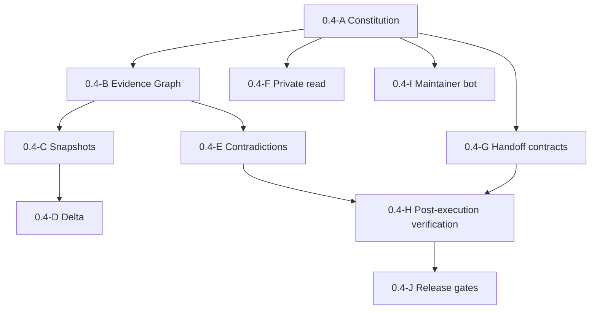

# OpsTruth 0.4.0 Plan

Status: proposed implementation plan
Release thesis: Evidence Graph

## Release promise

OpsTruth 0.4.0 moves from collecting independent verification signals to proving how those signals relate to the same exact repository, commit, CI run, artifact, deployment, runtime state, request, and receipt.

It expands evidence reach and evidence quality without adding target-system mutation authority.

## Defensible product boundary

| Capability | OpsTruth 0.4.0 | Execution plane | Maintainer bot |
| --- | --- | --- | --- |
| Observe repositories, CI, deployments, and runtime | Yes | Only as execution evidence | Only for this repo |
| Read private repositories | Yes, through brokered read-only scope | As separately authorised | Only this repo |
| Build evidence graph and state delta | Yes | No | Review implementation |
| Propose an action request | Yes | Consume it | Review contract drift |
| Authorise target mutation | No | Require external authority | No |
| Modify or deploy inspected systems | No | Yes, when explicitly authorised | No |
| Verify post-execution state | Yes, independently | No self-verification | Review implementation |
| Maintain OpsTruth source | No public product authority | No | Staged repo-only authority |

## Non-goals

- No target repository writes.
- No automatic remediation or deployment.
- No private tokens in MCP arguments.
- No central evidence-graph retention in this release.
- No autonomous merge authority for the maintainer bot.
- No claim that receipt validity proves outcome correctness.
- No breaking rename of the existing 0.3.1 public tools.

## Workstreams and acceptance gates

### 0.4-A: Architecture constitution

Deliverables:

- authority constitution;
- verifier and executor separation ADRs;
- private-access and maintainer-bot ADRs;
- corrected agent instructions;
- executable boundary checks.

Exit criteria:

- a mutation-capable public tool cannot pass CI;
- protected authority files have human ownership;
- the maintenance-plane exception is explicit and narrow.

### 0.4-B: Evidence Graph v1

Deliverables:

- versioned graph schema;
- node and edge registries;
- deterministic graph builder;
- canonicalization and digest fixtures;
- subject-binding rules.

Dependencies: 0.4-A.

Exit criteria:

- repository, commit, CI, artifact, deployment, and probe evidence can be represented;
- missing bindings remain `UNPROVEN`;
- graph output is deterministic for the same bounded evidence.

### 0.4-C: Portable signed snapshots

Deliverables:

- signed snapshot envelope;
- offline verification;
- signer-trust separation;
- compatibility metadata.

Dependencies: 0.4-B.

Exit criteria:

- a caller can retain and later verify a snapshot without OpsTruth storing it;
- tampering, schema mismatch, and unknown signer trust remain distinct results.

### 0.4-D: State delta

Deliverables:

- compatible-snapshot comparison;
- node, edge, authority, freshness, and verdict deltas;
- deterministic output fixtures.

Dependencies: 0.4-C.

Exit criteria:

- OpsTruth can answer what changed since a prior signed state;
- incompatible subjects or schema versions fail closed.

### 0.4-E: Contradiction detection

Deliverables:

- deterministic contradiction rules;
- contradiction edges and assertion-level verdicts;
- conflict-preserving report rendering.

Dependencies: 0.4-B.

Exit criteria:

- commit, artifact, deployment, route, and receipt conflicts have test fixtures;
- OpsTruth never resolves conflicting evidence by silently dropping a source.

### 0.4-F: Read-only private repository architecture

Deliverables:

- provider-app permission design;
- tenant isolation and token-broker boundary;
- revocation, expiry, and audit model;
- threat model and privacy review;
- redacted failure behavior.

Dependencies: 0.4-A. Production rollout also depends on security review.

Exit criteria:

- raw credentials cannot enter tool arguments or model-visible output;
- requested provider permissions are mechanically verified as read-only;
- public and private repository evidence share the same output contract;
- private identifiers do not enter aggregate analytics.

### 0.4-G: Execution handoff v1

Deliverables:

- ActionRequest, ActionAuthorization, ExecutionReceipt, and VerificationResult schemas;
- normative contract documentation;
- valid, invalid, tampered, expired, replayed, and partial fixtures;
- canonical digest and signature vectors.

Dependencies: 0.4-A.

Exit criteria:

- an executor can consume a request without receiving OpsTruth credentials;
- an ActionRequest grants no authority;
- receipt success is not mapped directly to verification success.

### 0.4-H: Post-execution verification

Deliverables:

- receipt-to-graph binding;
- expected-state assertion evaluator;
- `VERIFIED`, `PARTIAL`, `CONTRADICTED`, and `UNPROVEN` results;
- fresh-observation policy.

Dependencies: 0.4-B, 0.4-E, and 0.4-G.

Exit criteria:

- the verifier and executor use separate identities and keys;
- a forged, stale, or subject-mismatched receipt cannot produce `VERIFIED`;
- every verdict lists satisfied and unsatisfied assertions.

### 0.4-I: Maintainer bot v0

Deliverables:

- least-authority PR review workflow;
- deterministic changed-path and boundary report;
- protected-file policy;
- CODEOWNERS and pull-request template;
- staged authority documentation.

Dependencies: 0.4-A.

Exit criteria:

- v0 has contents read permission only;
- review output separates verified, risky, unproven, architecture, and release impact;
- protected changes always require a human owner;
- the bot cannot approve or merge its own work.

### 0.4-J: Evals and release gates

Deliverables:

- graph binding and contradiction evals;
- contract security fixtures;
- backward-compatibility suite;
- production health and signature smoke tests;
- release evidence packet.

Dependencies: all release workstreams.

Exit criteria:

- all mandatory gates below pass on the release commit;
- documentation matches the deployed public surface;
- remaining unknowns are explicitly listed.

## Mandatory release gates

| Gate | Required evidence |
| --- | --- |
| G0: Constitution | Boundary script and architecture tests pass |
| G1: Compatibility | Existing public tools and 0.3.1 receipt verification remain compatible |
| G2: Contract security | Schema, canonicalization, tamper, replay, expiry, and subject-binding fixtures pass |
| G3: Privacy | No graph, request, receipt, repository, URL, prompt, or user identity enters aggregate analytics |
| G4: Independent verification | Receipt success alone cannot produce `VERIFIED` |
| G5: Production | Health, MCP, policy routes, signing key, version, commit, and bounded probes are freshly checked |
| G6: Publication | Deployment, OpenAI review, directory publication, and version visibility are reported separately |

## Delivery order

Private access can be developed in parallel but must not block graph and contract work. It must not ship before its separate security and privacy gates pass.

## Rollout strategy

1. Land 0.4-A and maintainer bot v0 without changing the public MCP surface.
2. Introduce graph and contract code behind internal modules and fixtures.
3. Add new read-only tools only after output contracts and evals are stable.
4. Preserve old report fields during one minor-version compatibility window.
5. Roll out private read access to a bounded test installation before general availability.
6. Publish a release evidence packet with verified facts, risks, unknowns, and rollback criteria.

Each stage must be independently reversible. Schema versions are never silently reused for changed semantics.

## Risk register

| Risk | Mitigation | Release blocker |
| --- | --- | --- |
| Graph links unrelated evidence | Immutable subject identifiers and contradiction fixtures | Yes |
| Receipt validity is mistaken for outcome proof | Separate cryptographic, trust, authorization, and outcome verdicts | Yes |
| Private access expands authority | Brokered read-only permissions plus mechanical permission checks | Yes |
| Longitudinal state creates a privacy database | Portable caller-held snapshots by default | Yes |
| Maintainer bot becomes a privileged writer | Contents read v0, protected paths, staged authority | Yes |
| Schema drift breaks independent adapters | Versioned schemas, canonical vectors, compatibility suite | Yes |
| Analytics leak customer activity | Aggregate-only event design and regression tests | Yes |
| 0.4.0 becomes an executor project | Constitution CI and separate repository entry criteria | Yes |

## Success measures

Product measures should answer whether OpsTruth improves decisions without recording inspected subjects. Examples:

- percentage of graph-capable runs with complete commit-to-deployment binding;
- rate of `VERIFIED`, `PARTIAL`, `CONTRADICTED`, and `UNPROVEN` outcomes by tool version;
- number of contradiction classes detected by evals;
- snapshot and delta verification success rates;
- maintainer review gate pass and protected-change rates;
- contract interoperability results across test adapters.

Metrics must remain aggregate, coarse, and unable to identify a repository, user, prompt, or execution request.
